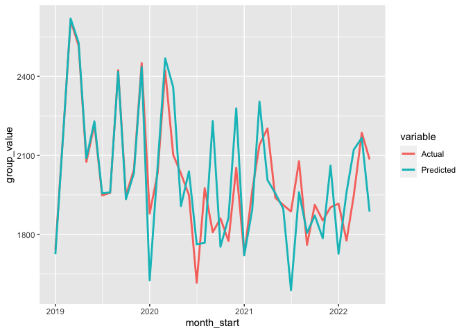

ARIMA Revenue Forecasting
================
Tom Trinter
December 9, 2019

# Revenue Forecasting - ARIMA Modeling

## Objective

The objective of this is to model product revenues to better inform
their forecasting process. This is derived from a Fortune 500 client
project where we had three years of monthly actual revenue data across
45 different products. These produts are grouped into 6 product groups.
The data has been sanitized and product names genericized to protect the
proprietary nature of the data and client privacy.

We’ll begin by modeling the revenues at the product-group level using
simple ARIMA models. We’ll then look at modeling at the individual
product level.

## Data

For this analysis, we’re starting with a spreadsheet where the data was
maintained manually for years in the treasury department. I’ll convert
the data from its ‘wide’ form into ‘long’ for easier use going forward.

#### Documentation

This approach follows the example found
[here](https://datascienceplus.com/time-series-analysis-using-arima-model-in-r/).

## Plot Product Groups

    ## `summarise()` has grouped output by 'summary_display'. You can override using
    ## the `.groups` argument.
    ## `geom_smooth()` using method = 'loess' and formula = 'y ~ x'

    ## Warning in simpleLoess(y, x, w, span, degree = degree, parametric =
    ## parametric, : Chernobyl! trL>n 6

    ## Warning in simpleLoess(y, x, w, span, degree = degree, parametric =
    ## parametric, : Chernobyl! trL>n 6

    ## Warning in sqrt(sum.squares/one.delta): NaNs produced

    ## Warning in simpleLoess(y, x, w, span, degree = degree, parametric =
    ## parametric, : Chernobyl! trL>n 6

    ## Warning in simpleLoess(y, x, w, span, degree = degree, parametric =
    ## parametric, : Chernobyl! trL>n 6

    ## Warning in sqrt(sum.squares/one.delta): NaNs produced

    ## Warning in simpleLoess(y, x, w, span, degree = degree, parametric =
    ## parametric, : Chernobyl! trL>n 6

    ## Warning in simpleLoess(y, x, w, span, degree = degree, parametric =
    ## parametric, : Chernobyl! trL>n 6

    ## Warning in sqrt(sum.squares/one.delta): NaNs produced

    ## Warning in simpleLoess(y, x, w, span, degree = degree, parametric =
    ## parametric, : Chernobyl! trL>n 6

    ## Warning in simpleLoess(y, x, w, span, degree = degree, parametric =
    ## parametric, : Chernobyl! trL>n 6

    ## Warning in sqrt(sum.squares/one.delta): NaNs produced

<!-- -->

Reviewing these plots to ensure that the transformations of the data to
remove any client reference resulted in usable data for the remainder of
the analysis. I’m looking for reasonably smooth values and generally
consistent order of magnitude.

## ARIMA Modeling

Looking at the time-series plots of grouped product revenues, there seem
to be some potential trends to extract before we can use an ARIMA model.
Let’s take a closer look at the Annuity data and add in a 1st difference
to see if that will get closer to stationary.

<!-- -->

Here I’m looking to see if the data is stationary. Since the bars in ACF
and PACF don’t cross the blue threshhold lines, I think we’re OK. Also,
using the auto.arima method, the models are auto-fit to different values
of autocorrelation, so it should be handled there as well.

## Components

<!-- -->

## Adjust for seasonality

From the decomposition plot above, it looks like there is some quarterly
seasonality as well as an overall decreasing trend.

So - we can remove both of those and fit a regression to them
separately? For now, just removing the trend…

## Unit Root Test:

After removing the trend component of the time series, let’s check if
the time series is stationary again:
<!-- -->

    ## 
    ## Title:
    ##  KPSS Unit Root Test
    ## 
    ## Test Results:
    ##   NA
    ## 
    ## Description:
    ##  Mon Jun 12 12:58:02 2023 by user:

<!-- -->

Since it is centered around zero, we can move on to modeling the
remaining timeseries. I’ll use `auto.arima` to fit a range of models to
the data, exploring different values for auto-regression and
differencing.

    ## 
    ##  ARIMA(2,0,2)(1,1,1)[12] with drift         : Inf
    ##  ARIMA(0,0,0)(0,1,0)[12] with drift         : 382.4658
    ##  ARIMA(1,0,0)(1,1,0)[12] with drift         : 383.7732
    ##  ARIMA(0,0,1)(0,1,1)[12] with drift         : 383.9847
    ##  ARIMA(0,0,0)(0,1,0)[12]                    : 380.173
    ##  ARIMA(0,0,0)(1,1,0)[12] with drift         : 384.9529
    ##  ARIMA(0,0,0)(0,1,1)[12] with drift         : 384.9563
    ##  ARIMA(0,0,0)(1,1,1)[12] with drift         : Inf
    ##  ARIMA(1,0,0)(0,1,0)[12] with drift         : 381.124
    ##  ARIMA(0,0,1)(0,1,0)[12] with drift         : 381.2891
    ##  ARIMA(1,0,1)(0,1,0)[12] with drift         : 383.593
    ## 
    ##  Best model: ARIMA(0,0,0)(0,1,0)[12]

Checking the residuals from the final ARIMA model - we’re looking for
residuals centered around zero and a normally shaped distribution.
<!-- -->

    ## 
    ##  Ljung-Box test
    ## 
    ## data:  Residuals from ARIMA(0,0,0)(0,1,0)[12]
    ## Q* = 15.584, df = 8, p-value = 0.04874
    ## 
    ## Model df: 0.   Total lags used: 8

## Create a Product Group Time-series Foreacast

Now that we have the time-series fit to an ARIMA model, we can forecast
forward for this product group.
<!-- -->

## Model the trend component

[Example
LM](https://datascienceplus.com/fitting-polynomial-regression-r/)

    ## 
    ## Call:
    ## lm(formula = trend_val ~ poly(days, 4), data = trend.data)
    ## 
    ## Residuals:
    ##      Min       1Q   Median       3Q      Max 
    ## -19.6865  -9.8945  -0.4501  12.4888  17.5373 
    ## 
    ## Coefficients:
    ##                Estimate Std. Error  t value Pr(>|t|)    
    ## (Intercept)    2013.361      1.928 1044.018  < 2e-16 ***
    ## poly(days, 4)1 -600.612     12.348  -48.639  < 2e-16 ***
    ## poly(days, 4)2  203.232     12.348   16.458  < 2e-16 ***
    ## poly(days, 4)3   51.238     12.348    4.149 0.000194 ***
    ## poly(days, 4)4 -130.366     12.348  -10.557 1.43e-12 ***
    ## ---
    ## Signif. codes:  0 '***' 0.001 '**' 0.01 '*' 0.05 '.' 0.1 ' ' 1
    ## 
    ## Residual standard error: 12.35 on 36 degrees of freedom
    ## Multiple R-squared:  0.9871, Adjusted R-squared:  0.9857 
    ## F-statistic: 691.3 on 4 and 36 DF,  p-value: < 2.2e-16

    ## Warning: Using `size` aesthetic for lines was deprecated in ggplot2 3.4.0.
    ## ℹ Please use `linewidth` instead.

    ## Don't know how to automatically pick scale for object of type <ts>. Defaulting
    ## to continuous.

<!-- -->

## Final Forecast

The final forecast is the combination of the forecasted time-series and
the forecasted trend. I’ll plot the actuals vs. forecasted to get an
idea of overall model fit.
<!-- -->

## Next Steps

Now that I’ve worked through one product group, there is more to be
done. Specifically, looking at individual product level forecasts, and
evaluating the model on test data that is outside of the data range used
to fit the models.
